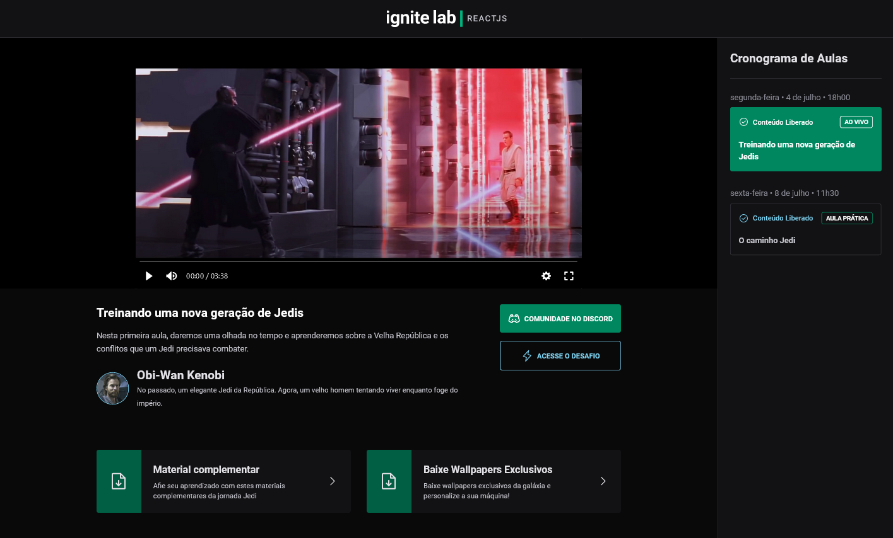

<!-- markdownlint-disable MD033 -->
<h1 align="center">Rocketseat - Event Platform</h1>

This is a Ignite Lab's project promoted by <a href="https://www.rocketseat.com.br/">Rocketseat</a>

<h3 align="center">Languages</h3>

  <a href="#">English</a> • <a href="./lang/README.pt-br.md">Português</a>

<!-- markdownlint-enable MD033 -->

## Table of contents

- [Overview](#overview)
  - [Screenshots](#screenshots)
  - [Links](#links)
- [My process](#my-process)
  - [Built with](#built-with)
  - [What I learned](#what-i-learned)
- [Author](#author)

## Overview

### Screenshots

| Tela Desktop |
|-------|
| |

### Links

- Live Site URL: [Cloudfare Pages](https://rct--event-platform.pages.dev/)

## My process

### Built with

- React
- Typescript
- GraphCMS
- TailwindCSS
- GraphQL
- GraphQL Codegen
- Phoshpor React
- React Router DOM
- Vite

### What I learned

Once more, with not surprise, Rocketseat promotes an awesome challenge. This was my first experience with GraphQL and GraphCMS, and I found it amazing. It was great to learn about GraphQL Codegen, as well as improving my knowledge on Typescript and TailwindCSS.

## Author

- [My Website](https://amodeusr.pages.dev)
- Github - [@AmodeusR](https://github.com/amodeusr)
- Linkedin - [@AmodeusR](https://www.linkedin.com/in/AmodeusR)
